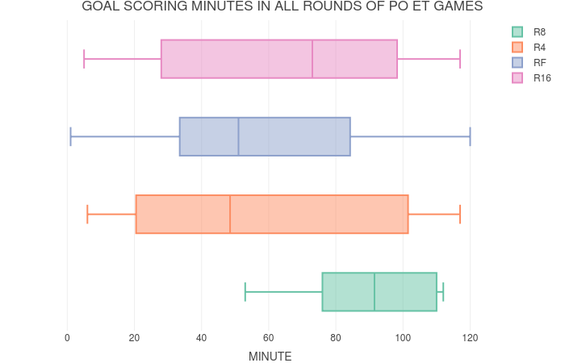

The goal of this small project is to analyze the play off round \b
games in champions league starting from its founding season. \b
Except the usual ways of determining a winner in a 2 match leg \b
there are two more rules to determine who goes to the next round, \b
one of them is away goal rule, according which is applied in cases when \b
the teams have the same amount of goals scored against each other in 2 games, \b
in such cases if one team has scored more goals while playing away it goes forward. \b
When even the number of goals scored in away games is the same for both teams, the teams \b
play an extra time in the second game of the leg \b
I believe that the away goal rule strongly affects the quality of the game and teams tend \b
to play more deffensive and static, in order to not lose their home advantage. \b
The same applies to extra times, as the teams are tired and the weaker ones tend to build \b
strong deffensive structure to last the 30 minutes and then win the game by penalties. \b
Through this project, I want to find out if some adjustements to these rules and situations \b
would change the picture. One modification is "cancellation" of away goal rule, let's suppose that \b
if teams have the same amount goals, but one of them has scored more, than a game in neutral stadium \b
would be played, so that neither would have a home advantage. \b
The modification applied to extra time games is an old cancelled rule. It is the famous rule of \b
golden goal rule according to which the team, that is first to score in the extra time is the winner. 

I have three main data frames, that data of which was initially scrapped and later cleaned and prepared \b
for analysis.


```{r setup, include=FALSE}
knitr::opts_chunk$set(echo = TRUE)
load("data/no_et_games.rda")
load("data/et_agr_94_18.rda")
load("data/legs_info.rda")
load("data/et_minutes.rda")
load("data/po_elos.rda")

packages_list <- c("ggplot2","dplyr", "scales", "DescTools",
                   "plotly", "stringr", "elo", "caret", "e1071")


install_or_call <- function(list = packages_list){
  installed <- installed.packages()[,"Package"]
  for( package in packages_list ){
    if(!(package %in% installed)){
      install.packages(package)
    }
    do.call(library, list(package))
  }
}

install_or_call()

```


```{r,echo=F, functions}
by_id <- function(data, var, id){
  return(data[data[var] == id,])
}

games_by_team <- function(data = all_games, team, field) {
  var <- "HOMETEAM"
  
  if(field == "A"){
    var <- "AWAYTEAM"
  }
  
  games <- data[data[var] == team,]
  return(length(games))
}

games_in_et <- function(data, team){
  h_games <- data %>%
    filter(HOMETEAM == team && TYPE == "ET" && LEG == 2)
  a_games <- data %>%
    filter(AWAYTEAM == team && TYPE == "ET" && LEG == 2)
  return(nrow(h_games) + nrow(a_games))
}

standings <- function(data) {
  as_ht <- data %>% 
    group_by(HOMETEAM) %>%
    summarise(W = sum(FTR == "H"),
              L = sum(FTR == "A"),
              D = sum(FTR == "D"),
              HTGF = sum(HTHG),
              HTGA = sum(HTAG),
              FTGF = sum(FTHG),
              FTGA = sum(FTAG),
              ETGF = sum(ETHG),
              ETGA = sum(ETAG))
  
  as_at <- data %>%
    group_by(AWAYTEAM) %>%
    summarise(W = sum(FTR == "A"),
              L = sum(FTR == "H"),
              D = sum(FTR == "D"),
              HTGF = sum(HTAG),
              HTGA = sum(HTHG),
              FTGF = sum(FTAG),
              FTGA = sum(FTHG),
              ETGF = sum(ETAG),
              ETGA = sum(ETHG))
  
  table <- data.frame(TEAM = as_ht$HOMETEAM, W = as_ht$W + as_at$W,
                     D = as_ht$D + as_at$D, L = as_ht$L + as_at$L, FTGF = as_ht$FTGF + as_at$FTGF,
                     FTGA = as_ht$FTGA + as_at$FTGA, ETGF = as_ht$ETGF + as_at$ETGF, 
                     ETGA = as_ht$ETGA + as_at$ETGA, HTGF = as_ht$HTGF + as_at$HTGF,
                     HTGA = as_ht$HTGA + as_at$HTGA)
  table$M <- table$W + table$D + table$L
  table$POINTS <- 3 * table$W + table$D
  table$STGF <- table$FTGF - table$HTGF
  table$STGA <- table$FTGA - table$HTGA
  table$EGM <- sapply(table$TEAM, games_in_et, data = et_agr)
  return(table %>%
           select(TEAM, M, POINTS ,everything()) %>%
           arrange(desc(POINTS)))
}

cl_po_k <- function(table){
  table <- table %>%
    filter(!(W == 0))
  table$FTGD <- table$FTGF - table$FTGA 
  table$ETGD <- table$ETGF - table$ETGA
  table$WPCT <- (table$W + round(table$D / 3)) / (table$M)
  table$RATIO <- table$FTGF / table$FTGA
  k_model <- lm(log(WPCT) ~ 0 + log(RATIO), data = table)
  k <- coefficients(k_model)
  table$EWPCT <- table$FTGF ^ k / ((table$FTGF)^k + (table$FTGA)^k)
  return(table)
}

gold_goal <- function(data) {
  gold_minutes <- data %>% 
    filter(MINUTE > 90) %>%
    group_by(LEG_ID) %>%
    summarise(MINUTE = min(MINUTE))
  winners <- data %>%
    inner_join(gold_minutes, by = c("MINUTE", "LEG_ID"))
  return(winners)
}

get_elos_by_date <- function(source, game_date, game_team) {
  elos <- source %>% 
    filter(team == game_team , date <= game_date ) %>%
    arrange(desc(date))
  return(elos[1,]$rating)
}

neutral_games <- function(data) {
  agr_legs <- data %>%
    filter(TYPE == "AGR")
  elo_teams <- unique(po_elos$team)
  result <- c()

  for(i in 1:nrow(agr_legs)){
    leg <- agr_legs[i,]
    team1 <- as.character(leg$TEAM1)
    team2 <- as.character(leg$TEAM2)
    l2date <- leg$L2D
    if(team1 %in% elo_teams && team2 %in% elo_teams){
      elo1 <- get_elos_by_date(source = po_elos, game_date = l2date, game_team = team1)
      elo2 <- get_elos_by_date(source = po_elos, game_date = l2date, game_team = team2)
      wins.1 = elo.prob(elo.A = elo1,
                        elo.B = elo2)
      wins.2 = 1 - wins.1
      game <- data.frame(TEAM1 = team1, TEAM2 = team2, WINS.1 = wins.1, WINS.2 = wins.2,
                         LEG_ID = leg$LEG_ID, ACTUAL_WINNER = leg$WINNER)
      result <- rbind(result, game)
    }
  }
  result$TEAM1 <- as.character(result$TEAM1)
  result$TEAM2 <- as.character(result$TEAM2)
  result <- result %>%
    mutate(ACTUAL.1 = ifelse(ACTUAL_WINNER == TEAM1, 1, 0),
           ACTUAL.2 = ifelse(ACTUAL_WINNER == TEAM2, 1, 0),
           NG_WINNER = ifelse(WINS.1 > WINS.2, TEAM1, TEAM2))
  return(result)
}

rand_0_1 <- function() {
  return(round(runif(n = 1, min = 0, max = 1)))
}


```

This is the general overview of the format of games table. \b
Except the obvious variables it also contains some other variables \b
which were used for the analysis.

```{r, echo=F, data, fig.height=20, fig.width=20}
all_games <- rbind(games, et_agr)

games_no_rares <- all_games %>%
  filter(HOMETEAM %in% unique(po_elos$team),AWAYTEAM %in% unique(po_elos$team))

legs_summary <- legs_info %>%
  group_by(TYPE) %>%
  summarise(COUNT = n())

knitr::kable(games_no_rares[1:10,1:9])
```

The legs information data frame contains information about the leg's games. \b
The dates for both games, the winner, the round, the number of goals scored by both teams \b
and the rule through which the winner was determined.
```{r, echo = F, data1}
knitr::kable(legs_info[1:10,1:6])
```


I also got the goal scoring minutes of the games that ended up in an extra time.
```{r, echo = F, data2}
knitr::kable(et_minutes[1:10,])
```


```{r,echo=F,legs}
pie <- plot_ly(legs_summary, labels = ~TYPE, values = ~COUNT, type = 'pie',
             textposition = 'inside',
             textinfo = 'label+percent',
             insidetextfont = list(color = '#FFFFFF'),
             hoverinfo = 'text',
             text = ~paste(TYPE),
             marker = list(line = list(color = '#FFFFFF', width = 1)),
             showlegend = F) %>%
  layout(title = "DETERMINING LEG'S WINNER IN UCL PO ROUNDS",
         xaxis = list(showgrid = F, zeroline = F, showticklabels = F),
         yaxis = list(showgrid = F, zeroline = F, showticklabels = F))

```

As expected majority of the leg winners were decided through the standard rule of who scored more \b
We can see there were more legs where the away goal rule was applied and the application of \b
extra time was a rare event in playoff rounds, occuring only in 8 percent of the legs. \b
Having around 500 games in the playoff rounds, divided equally into 250 legs, we can \b
observe that the results of around 50 of the legs were "suspicios" and "not expected" \b
In order to predict the expected winners of the legs, in which away goal rule was used, I will \b
get the elo ratings of the teams based on the second game's date and won't treat any of them as a \b
home team. For the games in extra time, I will apply golden goal rule to see if it would change anything.


```{r, echo=F, allGames}
all_games <- all_games %>%
  mutate(FTR = ifelse(FTHG > FTAG, "H", ifelse(FTHG < FTAG, "A", "D")),
         HTG = (FTHG + ETHG + PTHG),
         ATG = (FTAG + ETAG + PTAG),
         GR = ifelse(HTG > ATG, "H", ifelse(HTG < ATG, "A", "D")))
```

```{r, echo=F, box2, warning=F}
table <- standings(data = all_games)
box_2 <- plot_ly(table, x = ~M, type = "box") %>%
  layout(title = "NUMBER OF PO MATCHES BY TEAMS",
         yaxis = list(showgrid = F, zeroline = F, showticklabels = F),
         xaxis = list(showgrid = T, zeroline = F, showticklabels = T))
# box_2

```


As we can see there are only a few teams, \b
that have a high number of games played in the play off round. \b
Those teams are Real Madrid,Fc Barcelona, Bayern Munich, MU and teams of similar ranking. \b
There is no outlying behavior in the amount of games played by the other teams as except \b
top teams, most of the teams in the play off round are usually repeating with some different \b
teams appearing in high stages of the championship by chance or by good draw. \b
Let's build a standings table for the teams based on all games that they played in the playoff rounds \b
In order to have meaningful predictions, I have removed some teams played in less than one playoff leg \b
over those 25 years, and unfortunately Lazio was among those :(, but Mr.Madoyan please don't leave the paper \b
as you will enjoy the later foundings.I also removed the teams, for which I was not able to get the elo ratings \b
from the data I managed to find. So this is how the CL playoff rounds table looks like


```{r, echo=F, wpct}
# All teams with elo ratings
wpct_table <- cl_po_k(table)
p <- ggplot(wpct_table, aes(x = EWPCT, y = WPCT, text = TEAM)) +
    geom_point() + 
    geom_abline(intercept = 0, slope = 1, col = "red")

p <- ggplotly(p)%>%
  layout(title = "EXPECTED WIN PERCENTAGE VS ACTUAL",
         yaxis = list(showgrid = F, zeroline = F, showticklabels = F),
         xaxis = list(showgrid = T, zeroline = F, showticklabels = T))
# 
```

```{r, echo=F, luckyUnlucky}
lucky_teams <- wpct_table %>%
  filter(WPCT > EWPCT)

unlucky_teams <- wpct_table %>%
  filter(WPCT < EWPCT)

expected_teams <- wpct_table %>%
  filter(WPCT == EWPCT)

wpct_table_1 <- wpct_table %>%
  filter(M >= 4)
```

```{r, echo=F, table}
knitr::kable(wpct_table_1[1:15,c(1:8,18,20)])
```

As the table clearly shows, most of the top teams were expected to win more games \b
based on their goal differences.


```{r, echo=F, corr}
cor.test(wpct_table_1$WPCT, wpct_table_1$FTGD)
```

As we can see the correlation between Win Percentage and Goal Difference exists, but is not that high \b
compared to previous measurements done during class practice. For example in La Liga this coefficient \b
was around 0.87. This is a good point for starting to make some conclusions. As the Goal Difference is \b
mostly used for measuring team's "ranking" and "class". Having this information, let's analyze this  \b
connection in Champions League Play off rounds. Let's make very rough estimations. Having a correlation \b
coefficient of 0.55 we can have general assumptions that only about the half of the teams get what \b
they deserve based on their "class"


 
```{r, echo=F, luckyUnlucky1}
lucky_teams_1 <- wpct_table_1 %>%
  filter(WPCT > EWPCT)

unlucky_teams_1 <- wpct_table_1 %>%
  filter(WPCT < EWPCT)

expected_teams_1 <- wpct_table_1 %>%
  filter(WPCT == EWPCT)

# lucky_teams %>%
#   anti_join(lucky_teams_1)
knitr::kable(lucky_teams_1[1:10,c(1:8,18,20)])
```

Those are the lucky teams. I hope you find some interesting names here :). 

```{r, echo=F, unlucky}
# This azeri sponsored, deffensive team is not worth to be shown in the report
knitr::kable(unlucky_teams_1[1:10,c(1:8,18,20)] %>%
               filter(TEAM != "Atlético Madrid"))
```


```{r, echo=F, plotWpct}
p1 <- ggplot(wpct_table_1, aes(x = EWPCT, y = WPCT, text = TEAM)) +
  geom_point() + 
  geom_abline(intercept = 0, slope = 1, col = "red")

p1 <- ggplotly(p1)%>%
  layout(title = "EXPECTED WIN PERCENTAGE VS ACTUAL",
         yaxis = list(showgrid = F, zeroline = F, showticklabels = F),
         xaxis = list(showgrid = T, zeroline = F, showticklabels = T))


```

This visualization shows the overall picture. As we can see there are more teams who win less than \b
they were expected rather than teams that win more than expected


```{r, echo = F, box1}
et_minutes <- et_minutes %>% 
  mutate(ROUND = by_id(all_games, "GAME_ID", GAME_ID)$ROUND)

box <- plot_ly(et_minutes, x = ~MINUTE, color = ~ROUND, type = "box") %>%
  layout(title = "GOAL SCORING MINUTES IN ALL ROUNDS OF PO ET GAMES",
         yaxis = list(showgrid = F, zeroline = F, showticklabels = F),
         xaxis = list(showgrid = T, zeroline = F, showticklabels = T))

# box


```

As we can see the goals scored in the late stages of the games are mostly occuring in the extra time \b
games of quarter finals, where most of the goals occur in minutes from around 75 to 110, in this round \b
the first goals are usually scored after the first half. This round is the only one having this property \b
Semi final games also had some late goals, but most of them before 100th minute and earliest of them in \b
the first half beginning periods. In the final games, which ended up in an extra time, most of them went \b
to penalties as the teams play extra "carefully" in the extra time period of final games. Some teams \b
can get to the round of 16 by chance, and win their leg by "killing" the game. Those "lucky" teams \b
can still occur in the quarter finals, but the chance is lower as they are mostly expected to be beaten \b
by strong teams in the round of 16. The "lucky" teams mostly get to higher stages due to a good draw. \b
To cap it all the density of goals scored in the late stages of the game is highest in R4 extra time games. \b
As this is the round where most of the "lucky" and game "killing" teams are mostly eliminated, but can still \b
occur.


```{r, echo=F, etMinutes}
hist <- ggplot(data=et_minutes, aes(x = MINUTE)) + 
  geom_histogram(breaks=seq(0, 120, by=10), 
                 col="red", 
                 fill="green", 
                 alpha = .2) + 
  labs(title="Histogram for Goal Minutes", x="Minutes", y="Number of Goals") + 
  xlim(c(0,120))
# hist_ly <- ggplotly(hist)
# hist_ly
hist
```
The histogram shows the general picture of the goal's scoring minutes. \b 
The highest frequencies of goals in extra time occur in the following ranges \b
of the game time, 50 - 60 (second half "game engine" time as some time is passed from the start \b
and there is still plenty of time left till the final whistle), 100 - 110, 110 -120(intrigue killing goals, \b
as the times are completely tired and almost no time is left ), 70 - 80(bringing intrigue as there is \b
a chance for a comeback for the team that allowed the goal), 80 - 90 (intrigue killing goals or goals \b
leading to extra time) 


```{r, echo=F, warning = F, goldGoals}

golden_goal_winners <- gold_goal(data = et_minutes)

golden_goal_winners$WINNER <- golden_goal_winners$WS

gg_r_winners <- et_minutes %>%
  inner_join(golden_goal_winners, by = c("MINUTE", "LEG_ID"))

colnames(gg_r_winners)[6] <- "GGR.WINNER"

gg_r_winners <- gg_r_winners %>%
  select(HOMETEAM.x, AWAYTEAM.x, ROUND.x, GGR.WINNER, WINNER ,MINUTE)
colnames(gg_r_winners) <- c("HOMETEAM","AWAYTEAM","ROUND","GGR.WINER","WINNER","MINUTE")
knitr::kable(gg_r_winners)
```

As we can see, we have only rare cases of games in extra time where the Golden Goal rule can be applied \b
and it wont change anything, as the actual winners won't change for any of those 7 games. \b
Maybe people in UEFA knew something, when they cancelled the rule :) \b
Now let's apply the modification for away goal rule and simulate neutral games among the teams.


```{r, echo=F, simulate}
simulated_games <- neutral_games(data = legs_info)
simulated_games <- simulated_games %>%
  mutate(PREDICTED.1 = ifelse(WINS.1 > 0.5,1,
                              ifelse(WINS.1 < 0.5, 0, rand_0_1())),
         PREDICTED.2 = ifelse(WINS.2 > 0.5,1,
                              ifelse(WINS.2 < 0.5, 0, rand_0_1())))

outcome_changes <- simulated_games %>%
  filter(ACTUAL_WINNER != NG_WINNER) %>%
  select(TEAM1, TEAM2, ACTUAL_WINNER, NG_WINNER, WINS.1, WINS.2)

knitr::kable(outcome_changes)
```

This modification changed the outcome of 11 legs of away goal rule. Having in general \b
46 legs with away goal rule application we can observe that 23 % of the game outcomes \b
could have been different, which in case could change the later game results too.


```{r, echo=F, brier}
agr_brier_1 <- BrierScore(pred = simulated_games$WINS.1, resp = simulated_games$ACTUAL.1)
agr_brier_1
```


```{r, echo=F, conf}
agr_conf_1 <- confusionMatrix(data = factor(simulated_games$ACTUAL.1),
                              reference = factor(simulated_games$PREDICTED.1))
agr_conf_1

```

The brier score and the confustion matrix metrics, show that the predictions based on the team's ratings \b
are not highly accurate for champions league play off rounds games, meaning that most of them are \b
unpredictible, which is partly the answer for my research question. As most of the games are unpredictible \b
it means that the strong teams applying their full potential of skills can lose to weaker teams in terms of \b
both game metrics and UCL current rules. Golden Goal rule won't change anything, but the Neutral Game rule \b
has a potential of making some huge changes in the league.


#TO CONCLUDE

This was a little project, the reasons behind which were mostly enthusiastic rather than scientific. \b
I spent most of the time on scrapping, cleaning and preparing the data for analysis. However, as the \b
scope of the games that fit my project goal(Extra time legs or Away goal rule application), the results \b
are based on a small set of observations. If I had enough time and opportunity, I would include more \b
similar games to have higher set of information. Also, in case of time availability I would get more \b
information on goal scoring minutes, to build flexible models for estimating the teams chances to win\b
based on the time when it allowed a goal, in order to have more observations for golden goal rule application. \b
Nevertheless, I enjoyed the time spent on the project and the whole class, and I will surely dive deeper into \b
similar projects.